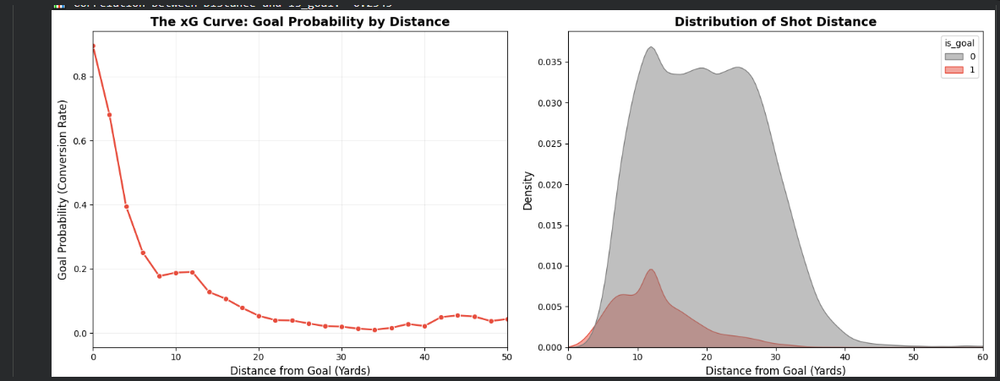
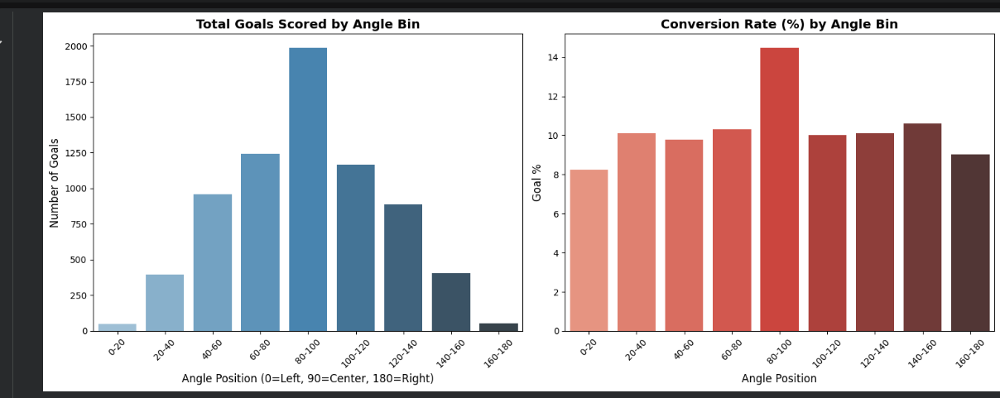
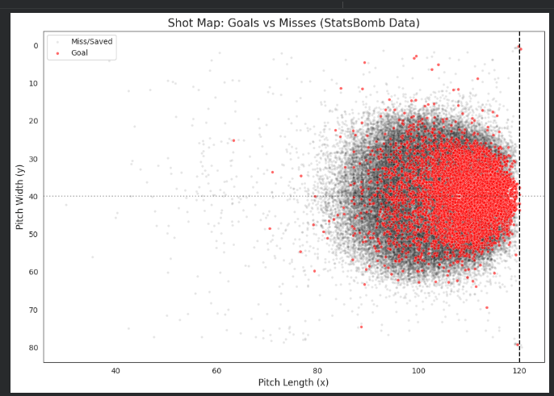
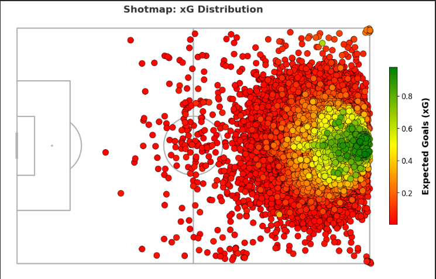

# xG-model: Expected Goals Modeling from StatsBomb Event Data

An end-to-end football analytics project to build, evaluate, and compare custom Expected Goals (xG) models using historical StatsBomb shot event data.

This repository covers the full workflow:
- ingesting historical event-shot data from StatsBomb,
- cleaning and encoding it for modeling,
- engineering spatial features (distance, angle, angle deviation),
- training and evaluating Logistic Regression and XGBoost models,
- benchmarking both against StatsBomb's own xG values,
- and visualizing shot/xG distributions through shot maps.

## Project Objectives

- Build a robust custom xG pipeline from raw event data.
- Compare two model families for shot conversion probability estimation:
  - Logistic Regression (baseline)
  - XGBClassifier (tree-based boosted model)
- Evaluate model quality using classification and probability-calibration style metrics.
- Compare custom model outputs against `shot_statsbomb_xg`.
- Produce interpretable visual outputs (distance curves, angle effects, shot maps).

## Repository Structure

```text
xG-model/
  data/
    01_raw_modern_master_shots.csv
    shots_cleaned_encoded.csv
    shots_final.csv
    XG_final_dataset.csv
  models/
    XG_lr_model.pkl
    XG_xgb_model.pkl
  notebooks/
    statsbomb_data_ingestion.ipynb
    statsbom_data_cleaning.ipynb
    feature_engineering.ipynb
    model_building_eval.ipynb
  visualizations/
    avg-distance.PNG
    distance-goal-correlation.PNG
    goal-angle.PNG
    shotmap.PNG
    xg_shotmap.PNG
```

## Data Pipeline and Process

### 1) Data Ingestion (Historical StatsBomb)
Notebook: `notebooks/statsbomb_data_ingestion.ipynb`

What this stage does:
- Uses `statsbombpy` to fetch competitions/seasons metadata.
- Filters target competitions and modern seasons (2015 onward in the notebook workflow).
- Iterates through matches and pulls only shot events (`events['shots']`) for efficiency.
- Appends competition/season metadata to each shot.
- Concatenates all season-level pulls into a single master dataset.
- Saves raw shot-level dataset to:
  - `data/01_raw_modern_master_shots.csv`

Notes from notebook outputs:
- Initial modern-season pull produced a large shot bank.
- Incremental ingestion logic is included to append newly available seasons over time.
- `shot_statsbomb_xg` availability is explicitly checked during ingestion audits.

### 2) Data Cleaning and Preprocessing
Notebook: `notebooks/statsbom_data_cleaning.ipynb`

What this stage does:
- Selects a modeling-relevant subset of shot columns.
- Parses `location` into numeric spatial coordinates:
  - `x`
  - `y`
- Handles boolean/contextual shot flags (missing values filled, converted to integer format where required).
- One-hot encodes key categorical columns:
  - `shot_body_part` -> `body_*`
  - `shot_technique` -> `tech_*`
  - `play_pattern` -> `pattern_*`
- Creates binary target variable:
  - `is_goal = 1` if `shot_outcome == 'Goal'`, else `0`
- Removes redundant `shot_outcome` after target generation.
- Reorders columns for a cleaner modeling table (with `x`, `y`, and target positioned early).
- Saves cleaned/encoded dataset to:
  - `data/shots_cleaned_encoded.csv`

### 3) Feature Engineering
Notebook: `notebooks/feature_engineering.ipynb`

Core engineered features:
- **Distance to goal center** (StatsBomb goal center at `(120, 40)`):
  - `distance = sqrt((120 - x)^2 + (40 - y)^2)`
- **Angle**
  - Implemented as goal-centric/protractor angle on a `0-180` scale:
  - `0 = left side`, `90 = central`, `180 = right side`
- **Angle deviation**
  - `angle_deviation = |angle - 90|`

Additional analysis in this stage:
- Distance vs goal-probability curve (binned conversion behavior).
- Goal-rate distributions by distance and by angle bins.
- Correlation checks between engineered features and goal outcomes.

Output dataset from this stage:
- `data/shots_final.csv`

### 4) Model Building and Evaluation
Notebook: `notebooks/model_building_eval.ipynb`

Feature groups used:
- Spatial features: `distance`, `angle`, `angle_deviation`
- Situational flags: first-time, pressure, one-on-one, deflection, open goal, redirect, follows dribble, aerial won
- Body-part one-hot features (`body_*`)
- Technique one-hot features (`tech_*`)
- Play-pattern one-hot features (`pattern_*`)

Split strategy:
- Train/test split = `80/20`
- `random_state=42`
- `stratify=y` to preserve class distribution

Models trained:
- Logistic Regression (`max_iter=1000`)
- XGBClassifier (`n_estimators=100`, `max_depth=3`, `learning_rate=0.1`, `eval_metric='logloss'`)

Evaluation metrics reported:

| Model | ROC-AUC | Log Loss | Brier Score |
|---|---:|---:|---:|
| Logistic Regression | 0.8063 | 0.2748 | 0.0785 |
| XGBClassifier | **0.8131** | **0.2702** | **0.0773** |

Interpretation:
- XGBClassifier achieved better discrimination (AUC), lower log loss, and better probability quality (Brier) than Logistic Regression.

### 5) Benchmark Against StatsBomb xG
Both custom models were compared against `shot_statsbomb_xg`.

#### XGB vs StatsBomb xG
- Correlation: **0.8663**
- Mean Absolute Error (MAE): **0.0395**

#### Logistic Regression vs StatsBomb xG
- Correlation: **0.8290**
- Mean Absolute Error (MAE): **0.0460**

Conclusion:
- The XGB model is closer to StatsBomb's xG than Logistic Regression.

### 6) Artifacts and Outputs
Saved model artifacts:
- `models/XG_xgb_model.pkl` (best-performing model)
- `models/XG_lr_model.pkl` (baseline model)

Saved final dataset with predictions:
- `data/XG_final_dataset.csv`

Visual outputs:
- `visualizations/distance-goal-correlation.PNG`
- `visualizations/avg-distance.PNG`
- `visualizations/goal-angle.PNG`
- `visualizations/shotmap.PNG`
- `visualizations/xg_shotmap.PNG`

## Visualization Gallery

### Distance and xG Behavior


### Goal Distribution by Angle


### Shot Map (Goals vs Misses)


### xG Distribution Shot Map (XGB Predictions)


## How to Reproduce

## Prerequisites
- Python 3.9+
- Jupyter Notebook or VS Code Notebook support

Suggested packages:
- pandas
- numpy
- matplotlib
- seaborn
- scikit-learn
- xgboost
- statsbombpy
- mplsoccer
- pickle (standard library)

Install example:

```bash
pip install pandas numpy matplotlib seaborn scikit-learn xgboost statsbombpy mplsoccer
```

## Recommended execution order
Run notebooks in this order:
1. `notebooks/statsbomb_data_ingestion.ipynb`
2. `notebooks/statsbom_data_cleaning.ipynb`
3. `notebooks/feature_engineering.ipynb`
4. `notebooks/model_building_eval.ipynb`

This order reconstructs the entire pipeline from raw shots to final trained models and visualization outputs.

## Current Status

Completed:
- Historical StatsBomb event data ingestion
- Cleaning + preprocessing + encoding
- Spatial feature engineering (`distance`, `angle`, `angle_deviation`)
- Training/evaluation of Logistic Regression and XGB xG models
- Model-vs-StatsBomb benchmark comparison
- xG distribution shot map generation from XGB predictions

Best model selected:
- **XGBClassifier**

## Future Work (Roadmap)

Planned next phase: **real-time xG system for live matches**.

### 1) Live Event Ingestion Layer
- Connect to live event feeds (StatsBomb live feeds where available, or equivalent providers such as Opta/Wyscout/API-Football/other event providers depending on access).
- Build a stream listener that ingests shot events in near real time.
- Standardize provider-specific payloads into one internal event schema.

### 2) Real-Time Feature Engine
- Compute on-the-fly features for every incoming shot:
  - location-based (`x`, `y`)
  - engineered (`distance`, `angle`, `angle_deviation`)
  - contextual (pressure/body-part/play-pattern when available)
- Handle missing live fields robustly with fallback logic.

### 3) Real-Time Inference Service
- Load `XG_xgb_model.pkl` in a lightweight prediction service.
- Score each incoming shot instantly.
- Maintain running aggregates:
  - team cumulative xG
  - player cumulative xG
  - xG timeline progression over match minutes

### 4) Live Visual Analytics
- Auto-refresh shot maps showing:
  - all shots by team
  - xG-weighted marker sizing/color
  - goals highlighted
- Continuously update xG distribution views and match-state dashboards.

### 5) Model Maintenance and Monitoring
- Monitor drift between live data behavior and training distribution.
- Periodically retrain with newly banked historical seasons.
- Keep benchmark checks against trusted external xG references.

### 6) Productization
- Wrap the live pipeline into an API + dashboard stack.
- Add logging, health checks, retry logic, and provider failover.
- Add unit/integration tests for feature parity and inference stability.

## Notes

- This project currently uses historical data workflows and notebook-first experimentation.
- The next major step is productionizing the trained XGB model for streaming/live use.
- As live provider schemas differ, a robust schema-mapping layer is essential before deployment.

---
